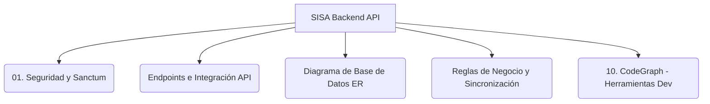

# SISA - Sistema Integrado de Seguimiento Academico
### Portal de la API Backend (Laravel 12 API REST)

Bienvenido al repositorio oficial del **Backend** de **SISA** (Sistema Integrado de Seguimiento Académico). Esta API REST proporciona el motor lógico, la persistencia, la sincronización y la seguridad para toda la plataforma web y móvil.

El backend está desarrollado utilizando **Laravel v12** (PHP 8.2+), siguiendo patrones de arquitectura robustos, controladores delgados (*Thin Controllers*), desacoplamiento mediante clases de *Servicios* y autenticación stateless por tokens mediante **Laravel Sanctum**.

---

## Indice de Documentacion Tecnica y Arquitectura

Toda la documentación detallada del sistema y su comportamiento en base de datos está disponible en la carpeta `docs/`. Explora los módulos a continuación:



### Recursos Criticos de la API:

*   **[Catalogo Completo de Endpoints (endpoints.md)](docs/endpoints.md):** Especificacion tecnica detallada de todas las rutas de la API, parametros del Request, payload del Response y codigos de estado HTTP.
*   **[Esquema y Diagrama de Base de Datos (diagrama_er_completo.md)](docs/diagrama_er_completo.md):** Definicion detallada de tablas, llaves primarias y foraneas, e indices de rendimiento de la base de datos de SISA.

### Capitulos Generales de Documentacion:

1.  **[Autenticacion y Roles](docs/01_autenticacion_seguridad.md):** Laravel Sanctum, roles de usuario (`SUPER_ADMIN`, `DIRECTOR_CARRERA`, `DOCENTE`), y control de acceso jerarquico.
2.  **[Gestion de Infraestructura Academica](docs/02_estructura_academica.md):** Modelos y relaciones para Sedes, Carreras, Campus, Bloques, Aulas e importacion de mallas.
3.  **[PAC (Plan Academico de Asignatura)](docs/03_pac_y_bibliografia.md):** CRUD y logica de carga jerarquica para unidades, temas y bibliografias.
4.  **[Algoritmo de Materias Comunes](docs/04_materias_comunes.md):** Logica del backend para merge inteligente, resolucion de conflictos y asignacion multiproposito.
5.  **[Planificacion Semestral](docs/05_planificacion_semestral.md):** Generador de secuencias didacticas automaticas basadas en el calendario academico.
6.  **[Control de Asistencia y Clases](docs/06_control_clase_seguimiento.md):** API de sincronizacion activa de clases firmadas, recepcion y almacenamiento de imagenes en servidor.
7.  **[Banco de Evaluaciones](docs/07_banco_preguntas_evaluaciones.md):** Motor de seleccion aleatoria de reactivos segun parametros y generacion masiva de PDF de examenes.
8.  **[Gestion de Evaluaciones y Rol de Examenes](docs/08_gestion_evaluaciones_y_examenes.md):** Directivas de examenes y calendario del Rol de Examenes con validaciones de colision en tiempo real.
9.  **[Sincronizacion y Motores de Comparacion](docs/09_sincronizacion_y_patrones.md):** Sincronizacion centralizada, comparadores analiticos pre/post sync, verificador lexical PDF y restaurador granular de backups.
10. **[CodeGraph - Herramientas de Desarrollo](docs/10_codegraph_dev_tools.md):** Grafo de conocimiento AST con tree-sitter para navegacion inteligente del codigo, busqueda estructural, trazado de flujos y analisis de impacto.

---

## Guia de Arranque Rapido para Desarrolladores

### Requisitos del Entorno
*   **PHP** >= 8.2 (con extensiones `pdo_mysql`, `mbstring`, `openssl`, etc.)
*   **Composer** >= 2.x
*   **MySQL / MariaDB**

### 1. Instalación de Dependencias
```bash
composer install
```

### 2. Configuración del Entorno
Duplica el archivo `.env.example` y renómbralo a `.env`:
```bash
cp .env.example .env
```
*Configura las credenciales de tu base de datos en las variables `DB_DATABASE`, `DB_USERNAME` y `DB_PASSWORD`.*

### 3. Generar la Llave de Aplicación y Enlace de Storage
```bash
php artisan key:generate
php artisan storage:link
```

### 4. Ejecución de Migraciones y Semillas (Seeders)
Crea la base de datos y llénala con datos de prueba oficiales:
```bash
php artisan migrate:fresh --seed
```

### 5. Iniciar Servidor de Desarrollo
```bash
php artisan serve
```
*La API estará disponible en `http://localhost:8000`.*

---

## Estandares y Convenciones

*   **Thin Controllers:** Los controladores se encargan estrictamente de HTTP.
*   **Service Pattern:** La lógica de negocio pesada reside en `app/Services/`.
*   **API Resources:** Transformación estandarizada de modelos a JSON en `app/Http/Resources/`.
*   **Seguridad:** Middlewares estrictos de control de accesos basados en roles.

---
Desarrollado para garantizar robustez y escalabilidad en SISA.
